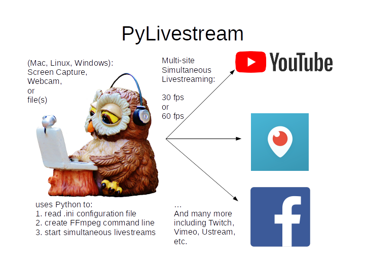

# Python scripted livestreaming using FFmpeg

[](https://zenodo.org/badge/latestdoi/91214767)


[](https://lgtm.com/projects/g/scivision/PyLivestream/context:python)
[](https://pypi.python.org/pypi/PyLivestream)
[](https://pepy.tech/project/pylivestream)

Streams to one or **multiple** streaming sites simultaneously, using pure object-oriented Python (no extra packages) and FFmpeg.
Tested with `flake8`, `mypy` type checking and `pytest`.
`visual_tests.py` is a quick check of several command line scripting scenarios on your laptop.
FFmpeg is used from Python `subprocess` to stream to sites including:

* [Facebook Live](#facebook-live)  (requires FFmpeg >= 4.2 due to mandatory RTMPS)
* [YouTube Live](#youtube-live)
* [Periscope](#periscope)
* [Twitch](#twitch)
* also Ustream, Vimeo, Restream.io and more for streaming broadcasts.



[Troubleshooting](./Troubleshooting.md)

## PyLivestream benefits

* Python scripts compute good streaming parameters, and emit the command used to copy and paste if desired.
* Works on any OS (Mac, Linux, Windows) and computing platform, including PC, Mac, and Raspberry Pi.
* Uses a [pylivestream.ini](./src/pylivestream/pylivestream.ini) file to adjust all parameters.

### PyLivestream limitations

* does *not* auto-restart if network connection glitches
* is intended as a bare minimum command generator to run the FFmpeg program
* is not intended for bidirectional robust streaming--consider a program/system based on Jitsi for that.
* generally does not work from Windows Subsystem for Linux 1 because of lack of hardware interface in WSL1. It works fine from native Windows.

### Design rationale

Why not do things without the command line, via linking libffmpeg, libgstreamer or libav?

* the command-line approach does not require a compiler or OS-dependent libraries
* once you get a setup working once, you don't even need Python anymore--just copy and paste the command line

## Install

Requirements:

* FFmpeg &ge; 3.0 (&ge; 4.2 for Facebook Live RTMPS)
* Python &ge; 3.6

Python &ge; 3.6 is required due to extensive use of type hinting to ensure program quality.

Latest release:

```sh
python3 -m pip install PyLivestream
```

Development version:

```sh
git clone https://github.com/scivision/PyLivestream

cd PyLivestream

python3 -m pip install -e .
```

## Configuration: pylivestream.ini

You can skip past this section to "stream start" if it's confusing.
The defaults might work to get you started.

The [pylivestream.ini](./src/pylivestream/pylivestream.ini) file contains parameters relevant to your stream.
This file is copied into your `sys.prefix`/share/pylivestream directory upon `pip install pylivestream`.

We suggest copying this file to another location on your hard drive and editing, then specifying it for your streams.

The `[DEFAULT]` section has parameters that can be overridden for each site, if desired.

* `screencap_origin`: origin (upper left corner) of screen capture region in pixels.
* `screencap_res`: resolution of screen capture (area to capture, starting from origin)
* `screencap_fps`: frames/sec of screen capture
* `video_kbps`: override automatic video bitrate in kbps

* `audiofs`: audio sampling frequency. Typically 44100 Hz (CD quality).
* `audio_bps`: audio data rate--**leave blank if you want no audio** (usually used for "file", to make an animated GIF in  post-processing)
* `preset`: `veryfast` or `ultrafast` if CPU not able to keep up.

Next are `sys.platform` specific parameters.

Seek help in FFmpeg documentation, try capturing to a file first and then update
[pylivestream.ini](./src/pylivestream/pylivestream.ini) for your `sys.platform`.

* exe: override path to desired FFmpeg executable. In case you have multiple FFmpeg versions installed (say, from Anaconda Python).

Finally are the per-site parameters.
The only thing you would possibly need to change here is the `server` for best performance for your geographic region.
The included [pylivestream.ini](./src/pylivestream/pylivestream.ini) is with default servers for the Northeastern USA.

### Deduce inputs

Each computer will need distinct pylivestream.ini device input parameters:

* audiochan: audio device
* webcamchan: webcam device
* screenchan: desktop capture software port name

Loopback devices that let you "record what you hear" are operating system dependent.
You may need to search documentation for your operating system to enable such a virtual loopback device.

#### Windows

```sh
ffmpeg -list_devices true -f dshow -i dummy
```

#### MacOS

```sh
ffmpeg -f avfoundation -list_devices true -i ""
```

#### Linux

```sh
v4l2-ctl --list-devices
```

## API

There are two ways to start a stream (assuming you've configured as per following sections).
Both do the same thing.

* command line via Python entry_points
    * FileGlobLivestream
    * ScreenshareLivestream
    * FileLoopLivestream
    * ScreenCapture2disk
    * WebcamLivestream
    * MicrophoneLivestream
* `import pylivestream.api as pls` from within your Python script. For more information type `help(pls)` or `help(pls.stream_microphone)`
    * pls.stream_file()
    * pls.stream_microphone()
    * pls.stream_webcam()


## Authentication


The program will load a `*.key` file according to the configuration file key for the website.
For example, Periscope expects to see the stream hexadecimal key in `~/periscope.key`, as obtained from phone Periscope app.
Likewise, YouTube expects a file `~/youtube.key` with the hexadecimal stream key and so on.

### YouTube Live

1. [configure](https://www.youtube.com/live_dashboard) YouTube Live.
2. Edit file `youtube.key` to have the YouTube hexadecimal stream key
3. Run Python script and chosen input will stream on YouTube Live.

    ScreenshareLivestream youtube

### Facebook Live

Facebook Live requires FFmpeg >= 4.2 due to mandatory RTMPS

1. configure your Facebook Live stream
2. Put stream ID from
    [<https://www.facebook.com/live/create>](https://www.facebook.com/live/create)
    into the file `~/facebook.key`
3. Run Python script for Facebook with chosen input

    ScreenshareLivestream facebook

### Periscope

1. create a new stream by EITHER:

    * from phone Periscope app, go to Profile -&gt; Settings -&gt; Periscope Producer and see your Stream Key.
      The "checking source" button will go to "preview stream" once you do step #2.
    * from computer web browser, go to  [Periscope Producer](https://www.periscope.tv/account/producer) and Create New Source.
2. Put the hexadecimal stream key into `~/periscope.key`
3. Run Python script for Periscope with chosen input

    ScreenshareLivestream periscope

I prefer using the Phone method as then the phone is a "second screen"
where I can see if the stream is lagging, and if I "leave broadcast" and
come back in, I can comment from my phone etc.

### Twitch

1. create stream from [Twitch Dashboard](https://dashboard.twitch.tv/settings/channel#stream-preferences). Edit [pylivestream.ini](./src/pylivestream/pylivestream.ini) to have the [closest ingest server](https://stream.twitch.tv/ingests/).
2. put Twitch stream key into file `~/twitch.key`
3. Run Python script for Twitch with chosen input

    ScreenshareLivestream twitch

## Usage

Due to the complexity of streaming and the non-specific error codes FFmpeg emits, the default behavior is that if FFmpeg detects one stream has failed, ALL streams will stop streaming and the program ends.

* [pylivestream.ini](./src/pylivestream/pylivestream.ini) is setup for your computer and desired parameters
* `site` is `facebook`, `periscope`, `youtube`, etc.
* For `WebcamLivestream` and `ScreenshareLivestream`, more than one `site` can be specified for simultaneous multi-streaming
* remember to setup a `*.key` file with the hexadecimal stream key for EACH site first, OR input the stream key into the "key:" field of your `*.ini` file.

### Webcam

Note: your system may not have a webcam, particularly if it's a virtual machine.

Config:

* `webcam_res`: webcam resolution -- find from `v4l2-ctl --list-formats-ext` or webcam spec sheet.
* `webcam_fps`: webcam fps -- found from command above or webcam spec sheet

Stream to multiple sites, in this example Periscope and YouTube Live simultaneously:

```sh
WebcamLivestream youtube periscope
```

### Screen Share Livestream

Stream to multiple sites, in this example Periscope and YouTube Live simultaneously:

```sh
ScreenshareLivestream youtube periscope
```

### Image + Audio Livestream

Microphone audio + static image is accomplished by

```sh
MicrophoneLivestream youtube periscope -image doc/logo.jpg
```
or wherever your image file is.

### Audio-only Livestream

Audio-only streaming is not typically allowed by the Video streaming sites.
You can test it to your own computer by:

```sh
MicrophoneLivestream localhost
```

### File Livestream

Captions: if you have installed the optional `tinytag` Python module,
the Title - Artist will be added automatically onto the video from the
audio/video files.

#### Loop single video endlessly

```sh
FileLoopLivestream videofile site
```

#### several video files

Glob list of video files to stream:

```sh
FileGlobLivestream path site -glob glob_pattern
```

* `-glob` glob pattern of files to stream e.g. "*.avi"
* `-loop` optionally loop endlessly the globbed file list
* `-shuffle` optionally shuffle the globbed file list
* `-image` if you have AUDIO files, you should normally set an image to display, as most/all streaming sites REQUIRE a video feed--even a static image.
* `-nometa` disable Title - Artist text overlay

#### stream all videos in directory

Example: all AVI videos in directory `~/Videos`:

    FileGlobLivestream ~/Videos youtube -glob "*.avi"

#### stream endlessly looping videos

Example: all AVI videos in `~/Videos` are endlessly looped:

```sh
FileGlobLivestream ~/Videos youtube -glob "*.avi" -loop
```

#### stream all audio files in directory

Glob list of video files to stream. Suggest including a static -image (could be your logo):

```sh
FileGlobLivestream path site -glob glob_pattern -image image
```

* `path` path to where video files are
* `glob_pattern` e.g. `*.avi` pattern matching video files
* `-image` filename of image to use as stream background (REQUIRED for most websites)

Example: stream all .mp3 audio under `~/music` directory:

```sh
FileGlobLivestream ~/music youtube -glob "*.mp3" -image mylogo.jpg
```

Example: stream all .mp3 audio in `~/music` with an animated GIF or video clip repeating:

```sh
FileGlobLivestream ~/music youtube -glob "*.mp3" -image myclip.avi
```

or

```sh
FileGlobLivestream ~/music youtube -glob "*.mp3" -image animated.gif
```

### Screen capture to disk

This script saves your screen capture to a file on your disk:

    ScreenCapture2disk myvid.avi

## Utilities

* `PyLivestream.get_framerate(vidfn)` gives the frames/sec of a video file.
* `PyLivestream.get_resolution(vidfn)` gives the resolution (width x height) of video file.

## Notes

* Linux requires X11, not Wayland (choose at login)
* `x11grab` was deprecated in FFmpeg 3.3, was previously replaced by `xcbgrab`
* Reference [webpage](https://www.scivision.dev/youtube-live-ffmpeg-livestream/)

### FFmpeg References

* [streaming](https://trac.ffmpeg.org/wiki/EncodingForStreamingSites)
* [webcam](https://trac.ffmpeg.org/wiki/Capture/Webcam)
* webcam [overlay](https://trac.ffmpeg.org/wiki/EncodingForStreamingSites#Withwebcamoverlay)

#### Windows

* [gdigrab](https://ffmpeg.org/ffmpeg-devices.html#gdigrab)

DirectShow didn't work for me on Windows 10, so I used gdigrab instead.

* [DirectShow](https://trac.ffmpeg.org/wiki/DirectShow) device selection
* DirectShow [examples](https://ffmpeg.org/ffmpeg-devices.html#Examples-4)

### Stream References

* [Twitch parameters](https://help.twitch.tv/customer/portal/articles/1253460-broadcast-requirements)
* Twitch [ingest servers](https://stream.twitch.tv/ingests/)
* Twitch [encoding](https://stream.twitch.tv/encoding/)

* [Periscope parameters](https://www.pscp.tv/help/external-encoders)
* [YouTube Live parameters](https://support.google.com/youtube/answer/2853702)
* [Facebook Live parameters](https://www.facebook.com/facebookmedia/get-started/live)
* [Ustream parameters](https://support.ustream.tv/hc/en-us/articles/207852117-Internet-connection-and-recommended-encoding-settings)
* Vimeo [config](https://help.vimeo.com/hc/en-us/articles/115012811168)
* Vimeo [parameters](https://help.vimeo.com/hc/en-us/articles/115012811208-Encoder-guides)

### Logo Credits

* Owl PC: Creative Commons no attrib. commercial
* YouTube: YouTube Brand Resources
* Facebook: Wikimedia Commons
* [Periscope](periscope.tv/press)
